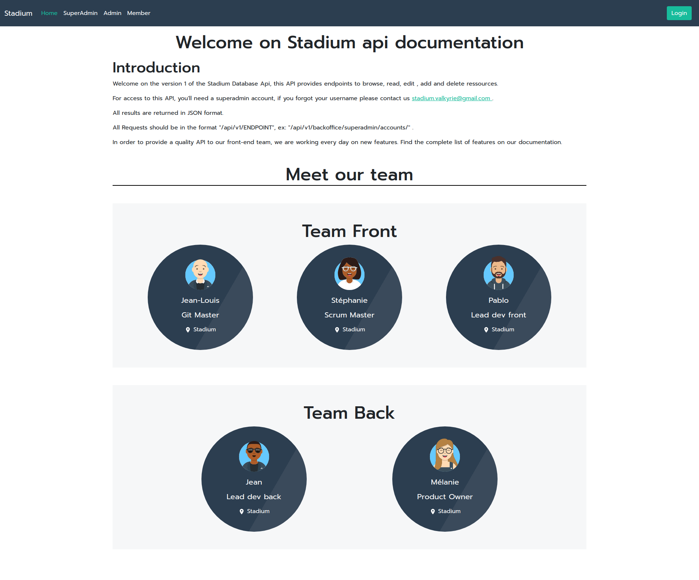

# STADIUM-FRONT
Ce projet est un clone de celui réalisé pour la fin de formation chez O'CLOCK en novembre 2021 avec Jean, Mélanie, Pablo et Stéphanie.

 :point_right: *le code principal est consultable sur la branche dev* 

**Présentation**

STADIUM est une plateforme à destination des associations sportives dont le but de faciliter la gestion administrative de leur adhérents. 

**Page d'accueil**

**Page d'accueil SuperAdministrateur**

**Tableau de bord SuperAdministrateur**

**Tableau de bord Administrateur (d'une association)**

**Documentation API Backend**

**Présentation de l'équipe STADIUM**

